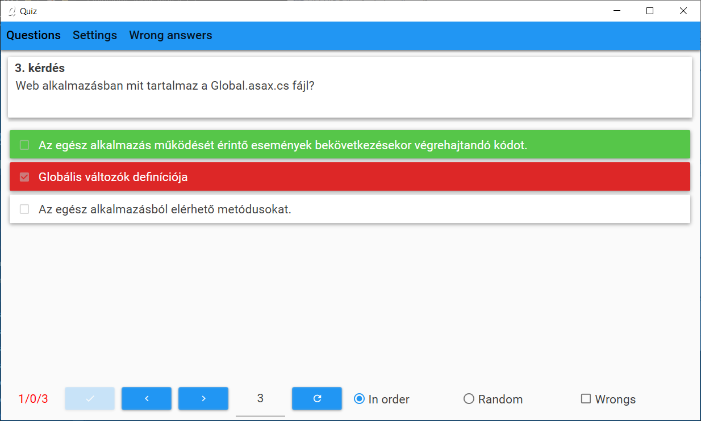
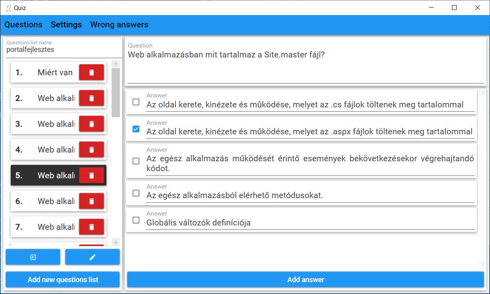
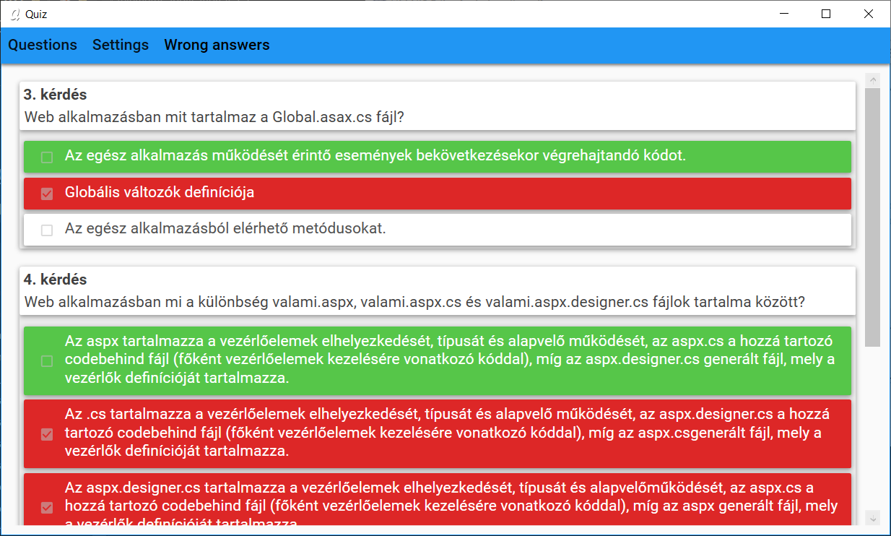

# Quiz program

This is a quiz program for Windows systems.

You can load questions and make question lists.

## Download

[You can download it from **Releases**.](https://github.com/bricsi0000000000000/quiz_program/releases)

Latest version is `2.0`

## Example file

There is an example file, so you can try it in `example_files/portalfejlesztes.json`.
